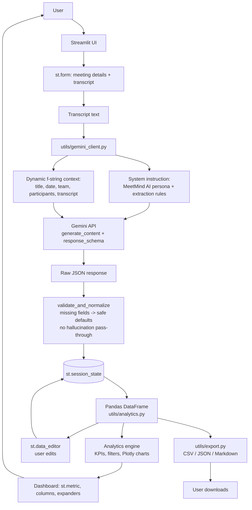

# MeetMind AI — Architecture

## High-level flow

## Component responsibilities

| Component | File | Responsibility |
|---|---|---|
| UI shell & orchestration | `app.py` | Page layout, form handling, session-state wiring, calling the pipeline |
| AI integration | `utils/gemini_client.py` | System instruction, dynamic prompt, structured-output call, JSON validation |
| Data pipeline | `utils/analytics.py` | DataFrame construction, deadline parsing, KPI/quality calculations, Plotly charts |
| Export | `utils/export.py` | CSV / JSON / Markdown report generation |

## Why this shape

- **Single Gemini call per submission.** The form (`st.form`) batches all
  inputs and only triggers `extract_action_items()` on explicit submit, so
  Streamlit reruns (e.g. from filter widgets or the data editor) never
  re-call the API.
- **Validation is a hard boundary.** Nothing downstream of
  `validate_and_normalize()` ever sees a missing key or an out-of-range
  value — it's the single place malformed AI output is made safe.
- **Session state is the source of truth.** The DataFrame in
  `st.session_state.action_items_df` is what the data editor, filters,
  charts, and export buttons all read from, so user edits are never lost
  on rerun.
- **No database.** Meeting history is kept in `st.session_state` for the
  current session only, per the project's "keep deployment simple"
  requirement.
